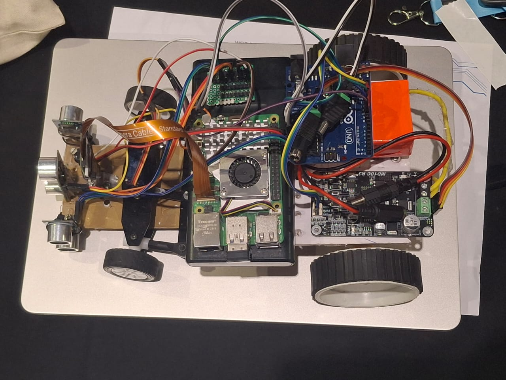

# Chassis and Structural Layout

The foundation of the robot is a **metal base plate**, which provides mechanical strength and rigidity to support all mounted subsystems. The bottom layer of this base is equipped with the **Steering System**, actuated by a **Servo motor** that precisely controls the angular orientation of the front wheels. This servo-based control enables accurate navigation and cornering, critical for path-following algorithms and obstacle avoidance. Positioned on the same bottom layer, the **motor** is connected to a **differential gearbox**, which is securely held in place by a **3D-printed holder**. The rear wheels are also attached to the gearbox using **3D-printed couplers**. Additionally, a **3D-printed camera stand** is placed on this bottom layer, located between the motor and the steering system. The 3D-models are present in the `models` folder.

A key design consideration is the robot’s **minimal ground clearance**, achieved through a **low-profile chassis configuration inspired by Formula 1 car engineering**. This design enhances **aerodynamic downforce**, improving **wheel-to-ground contact** during motion, resulting in significantly **increased stability**, particularly at higher speeds or during sharp directional transitions.

---
# Drive Mechanism

Located on the bottom layer, the motor serves as the **primary source** of **mechanical power** for the drivetrain. Its output shaft is **mechanically coupled to a differential gearbox**, held by a **3D-printed mount**, which splits torque between the two rear wheels. This allows each wheel to rotate at different speeds while receiving power from the same motor, a critical feature during turning maneuvers where inner and outer wheels travel different distances. The wheels are connected to the gearbox using **3D-printed couplers**, ensuring precise alignment and durability.

More about the differential gearbox is present in `Differential_Gearbox.md`.

---
# Battery Placement and Power Routing

On the bottom layer, four metallic spacers are mounted vertically at the rear corners and center, forming a platform to support a small metal plate on the next layer. This upper layer houses the **2500mAh Battery**, positioned to remain protected and thermally isolated from heat-generating components. The **wiring from the battery** is routed to the upper layer, which connects to the **motor as well as the arduino**. The battery efficiently regulates and distributes electrical power to the **Arduino Uno** and **motor**. The **Raspberry Pi 5** is powered by a **lithium ion 10000 Mah power bank** and are also placed on this upper layer, ensuring a compact and organized power management system.

---
# Sensor Configuration

The robot features a **three-sensor array** of **Ultrasonic sensors**, designed to optimize spatial awareness and real-time environmental perception. One sensor faces **directly forward**, providing accurate distance measurements along the primary axis of movement. The other two sensors are mounted at **45° angles** for the **open challenge round** forming a wide-angle, triangular sensing pattern and is mounted at **90° angles** for the **obstacle challenge round** to the **front-left** and **front-right** ensuring that it can sense all the walls in a correct manner. This configuration expands the robot’s **field of view**, enabling simultaneous obstacle detection, distance measurement, and angle estimation for approaching objects.

---
# Control Unit and Final Layer

The **topmost platform** hosts the **electronic control and processing unit**. The **Raspberry Pi 5**, located on the upper layer alongside the battery, powerbank and the arduino uno, serves as the **central processing unit (CPU)**, executing core decision-making algorithms. The **Arduino Uno** handles the ultrasonic sensors and gives commands that executes everything in place. A **5MP Raspberry Pi Camera Module**, mounted on a metal strip on the bottom layer, provides **real-time visual input** for vision-based functions like obstacle and color detection.

---
# Pictures

1. First Layer  
  
2. Second Layer  
  
3. Circuit Diagram  

