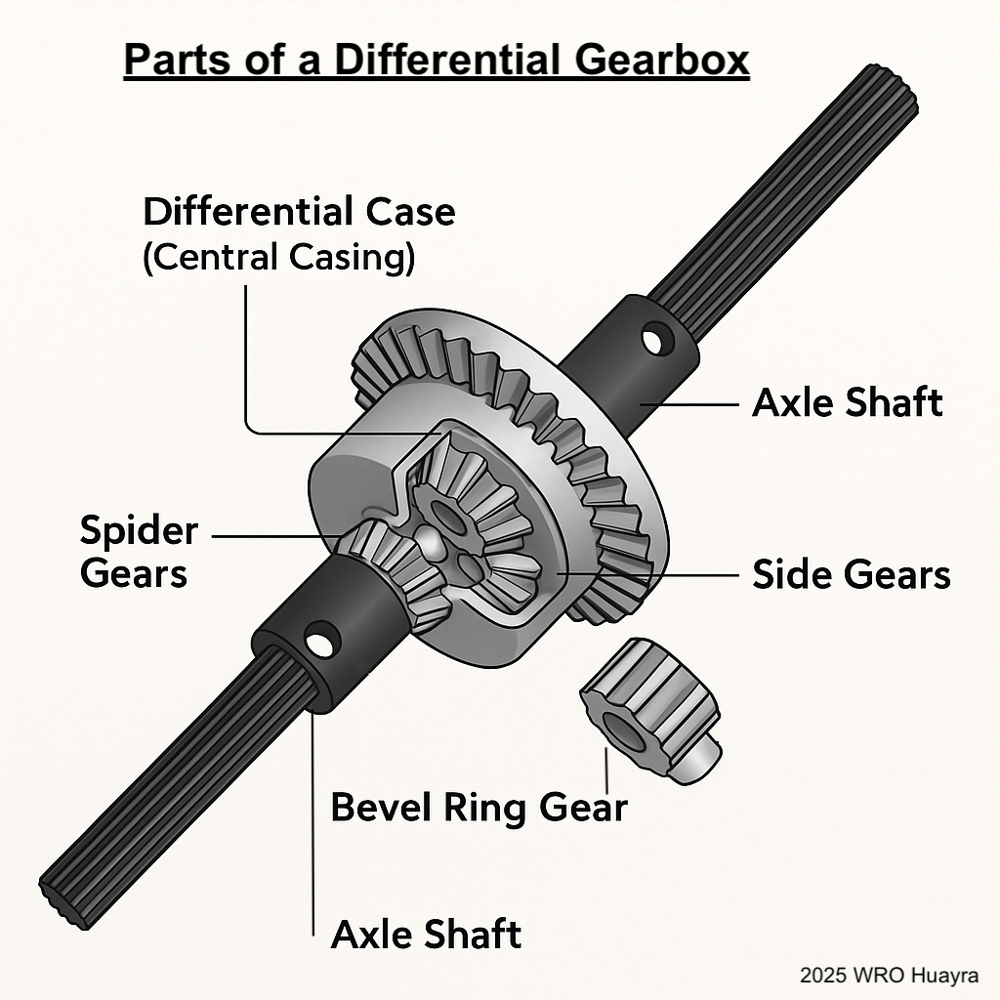
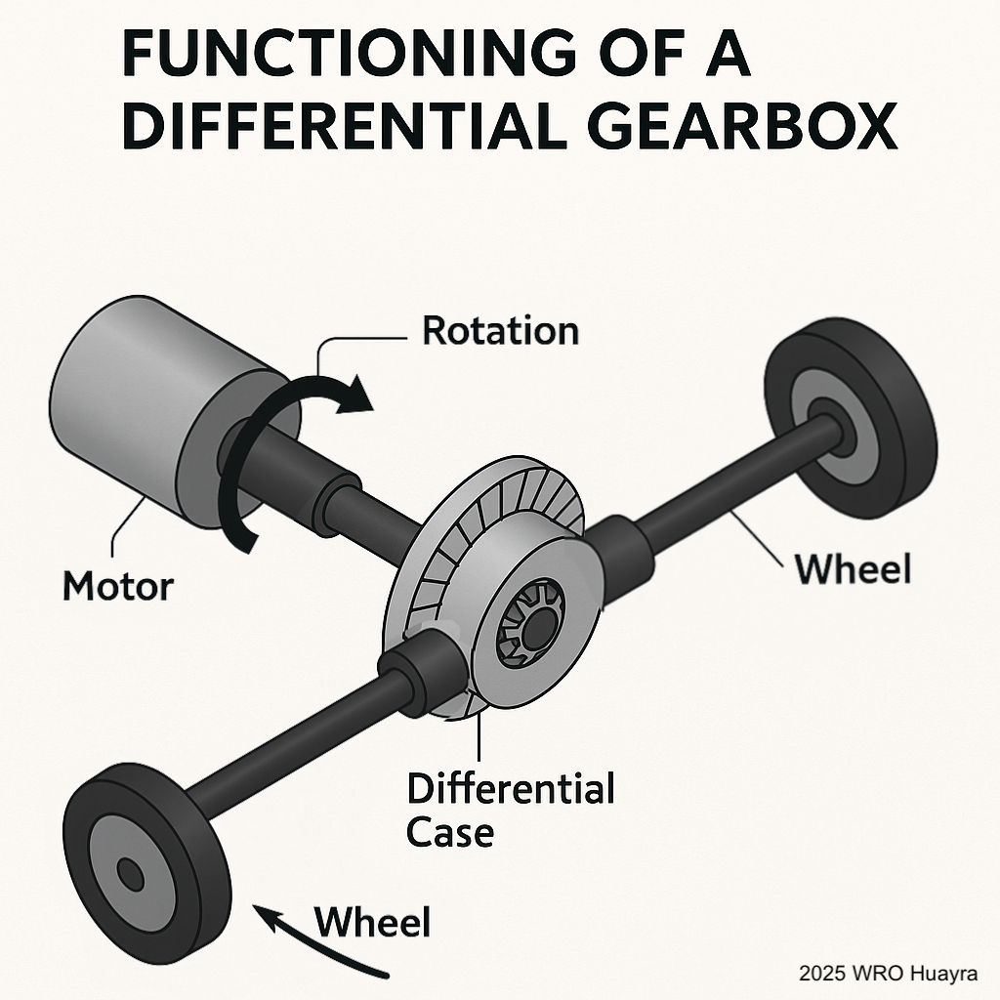

# Introduction  
  
A **differential gearbox** is a mechanical system that allows two output shafts to rotate at different speeds while receiving power from a common input. In our robot, it plays a critical role in enabling smooth cornering. The differential gearbox is connected to a motor, which provides the torque input. The gearbox then distributes this torque to two wheels, allowing for coordinated but variable-speed rotation depending on the robot’s direction of movement.  
  
# Mechanical Role  
  
When a robot turns, the wheel on the outside of the curve needs to rotate faster than the inner wheel. Without a differential, both wheels would be forced to rotate at the same speed, causing slippage, inefficient motion, and wear. By using a **differential gearbox**, the robot:  
1. Preserves traction and wheel alignment  
2. Minimizes motor load  
3. Increases maneuverability  
4. Prevents component strain during turns  
  
The gearbox’s placement after the motor and beside the wheels ensures that torque is split correctly, even during dynamic directional changes.  
  
# Explanation of Each Part(Image[1])  
  
**1. Differential Case (Central Casing)**  
  
The metallic housing, centrally located, serves as a crucial component that encases internal gears, such as spider gears. Its primary function is to efficiently transfer the input rotation to the entire internal gear system. This housing is designed to rotate synchronously with the input shaft, and it also supports and carries the ring gear.  
  
**2. Bevel Ring Gear**  
  
The ring gear, a larger toothed gear, is directly connected to the differential case. Its essential role is to receive power transmitted from the motor and then transfer this power to the differential case. This transfer of rotation to the ring gear in turn causes the entire differential assembly to spin, initiating the movement of the vehicle's wheels.  
  
**3. Axle Shafts (Left and Right Output Shafts)**  
  
The axle shafts are long, splined rods extending from both sides of the differential. Their crucial purpose is to transmit power from the internal spider gears directly to each wheel. During normal straight-line driving, both axle shafts rotate at equal speeds. However, when the vehicle navigates a turn, the differential allows the axle shafts to rotate at different speeds, accommodating the varying distances each wheel must travel.  
  
**4. Side Gears & Spider Gears**  
  
Spider gears are vital for the differential's function. Typically consisting of two or four small bevel gears, they are positioned on a perpendicular axis and mesh with the side gears, which are connected to the axle shafts. Their essential purpose is to enable the output shafts to rotate independently while continuously receiving power. This intricate system is what allows one wheel to rotate faster than the other, particularly when the vehicle is cornering.  
  
# Conclusion  
  
The output shafts of the differential gearbox are connected to two wheels. These wheels are mounted on the rear axle. When driving straight, both wheels receive equal torque and rotate at the same speed. When turning, the gearbox compensates automatically by allowing one wheel to rotate faster than the other.  
  
# Images  
  
1. Parts of a Differential Gearbox  
  
  
  
2. Functioning of a Differential Gearbox  

